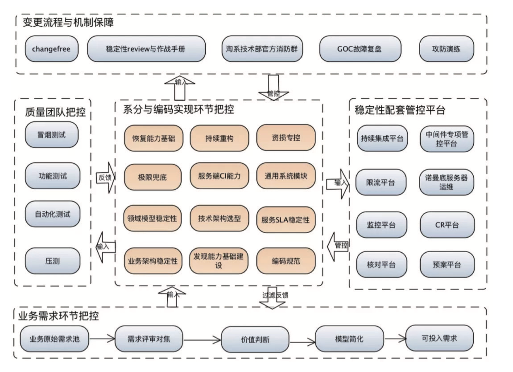
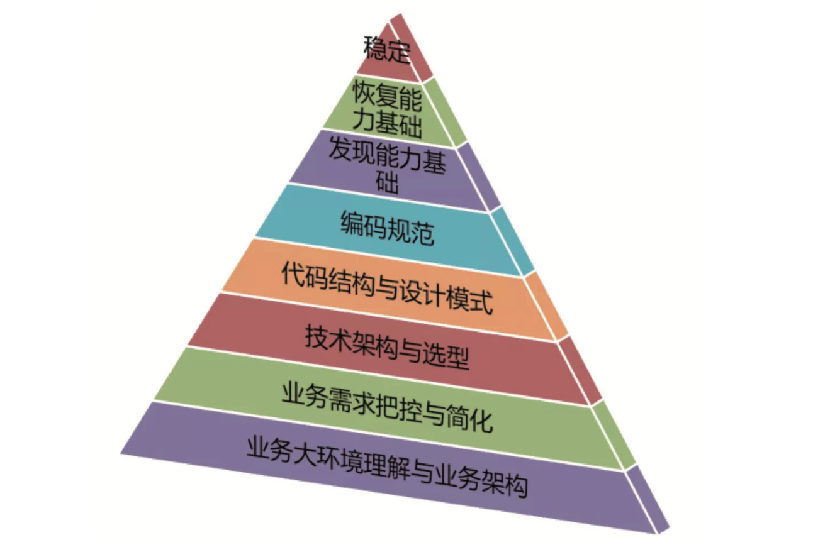

## Result接口设计

### 调用结果

- 有业务结果，通过返回值表达
  - 业务成功、业务失败
- 无业务结果
  - 系统异常

> - 荔枝的服务内部异常，是通过捕获后返回特定的响应码来实现的
>
> - Result和CheckedException是类似的；调用方除了处理正确和错误的结果，还需要处理Exception
>
>    基于前面的结论，业务失败应该通过返回值来表达，而不是异常; 而异常是不应该用于做业务逻辑判断的，那么java的Checked Exception就变成奇怪的存在了
>
> - **业务结果**和**异常**相互转化
>   - 弱依赖接口，吞掉异常，返回默认值
>   - 对于不应存在的业务错误，抛出异常

### 统一的Result

- 有个类复用errorCode、errorMsg以及相关的getter/setter等代码
- 避免直接包装原生类型
- 避免所有错误码定义在一个类中

## 如何避免写流水账代码

> 我们的代码中到处都是流水账式的代码，先做A，再做B，紧接着做C
>
> 常常混杂了业务计算、校验逻辑、基础设施、和通信协议
>
> 随着迭代功能的累积，最终->历史包袱。（比如送礼协议）

> **本质问题**
>
> 违背了SRP（Single Responsbility Principle)单一职责原则

需要用DDD的分层思想去重构一下以上的代码，通过不同的代码分层和规范，拆分出逻辑清晰，**职责明确的分层和模块**，也便于一些**通用能力的沉淀**。

- 分离出独立的Interface接口层，负责处理网络协议相关的逻辑
- 从真实业务场景中，找出具体用例(Use Cases)，然后将具体用例通过专用的CQE对象（Command指令、Query查 询、和Event事件）来承接。
- 分离出独立的Application应用层，负责业务流程的编排，响应Command、Query和Event。每个应用层的方 法应该代表整个业务流程中的一个节点
- 处理一些跨层的横切关注点，如鉴权、异常处理、校验、缓存、日志等

> ##### **规范**
>
> 1. Interface层的HTTP和RPC接口，返回值为Result，**捕捉所有异常**
> 2. Application层的所有接口返回值为DTO 而不是Entity，**不负责处理异常**

### 接口层

> 作为所有对外的门户，将网络协议和业务解耦。核心价值是对外
>
> 如果有统一网关层，可以抽离出鉴权、Session、限流、日志等
>
> 当一个现有接口类过度膨胀的时候，可以考虑对接口类做拆分，拆分原则就是SRP
>
> 接口层会跟着业务需求快速变化，通过独立的接口层可以避免业务互相影响，而Application层的逻辑会希望相对稳定

**主要功能**

1. 网络协议的转化
2. 统一鉴权
3. Session管理
4. 限流配置
5. 前置缓存
6. 异常处理（可以使用AOP注解处理）
7. 日志

### Application层

核心类

1. ApplicationService：负责业务流程编排，但不负责业务逻辑
2. DTO Assembler:负责将内部领域模型转化为可对外的
3. DTO Command、Query、Event对象:作为ApplicationService的入参。 CQE是有"意图"和"语意"的。
4. 返回的DTO:作为ApplicationService的出参

> ##### 规范
>
> 1. CQE规范，使用CQE作为application层的入参，唯一例外是根据ID查询
> 2. 参数的校验利用java标准JSR303或JSR380的Bean Validation来前置这个校验逻辑
> 3. 针对不同语意的指令，要避免CQE对象的复用（常见的一个反例：insert和update的请求参数）
> 4. ApplicationService负责了业务流程的编排，是将原有业务流水账代码剥离了校验逻辑、领域计算、持久化等 逻辑之后剩余的流程，是“胶水层”代码

> 判断是否业务流程的几个点
>
> 1. 不要有if/else分支逻辑:也就是说代码的Cyclomatic Complexity(循环复杂度)应该尽量等于1
> 2. 不要有任何计算
> 3. 一些数据的转化可以交给其他对象来做

> ##### 常用套路
>
> 我们可以看出来，ApplicationService的代码通常有类似的结构:
>
> AppService通常不做任何决策(Precondition 除外)，仅仅是把所有决策交给DomainService或Entity，把跟外部交互的交给Infrastructure接口，如Reposi- tory或防腐层。
>
> 一般的“套路”如下:
> 准备数据:包括从外部服务或持久化源取出相对应的Entity、VO以及外部服务返回的DTO。
> 执行操作:包括新对象的创建、赋值，以及调用领域对象的方法对其进行操作。需要注意的是这个时候通常 都是纯内存操作，非持久化。
> 持久化:将操作结果持久化，或操作外部系统产生相应的影响，包括发消息等异步操作。

### DTO Assembler

操作的Entity，返回的DTO，所以需要这样一次转换

MapStruct

### Result vs Exception

- 在Application层、Domain层，以及Infrastructure层，遇到错误 直接抛异常是最合理的方法
- 在Interface层统一捕捉异常是为了避免异常堆栈信息泄漏到 API之外

### Anti-Corruption Layer

防腐层

在一些理论框架里ACL Facade也被叫做Gateway，含义是一样的。

> ACL防腐层的简单原理如下: 
>
> 对于依赖的外部对象，我们抽取出所需要的字段，生成一个内部所需的VO或DTO类 构建一个新的Facade，在Facade中封装调用链路，将外部类转化为内部类 针对外部系统调用，同样的用Facade方法封装外部调用链路

## 系统实现层面稳定性保障

稳定性保障涉及机房、网络、硬件部署到业务场景、交互设计，再到应用架构代码质量、流量与封网管控、攻防 复盘等，是一项非常系统化的工程

- 网络、硬件、JVM监控等基本上由专门的运维、基础团队维护
- 业务主要是利用工具发现问题，业务稳定性工作的核心还是围绕系统与代码本身来开展，更应该着眼于系统设计 实现环节的控制

系统实现核心环节与稳定性关系

