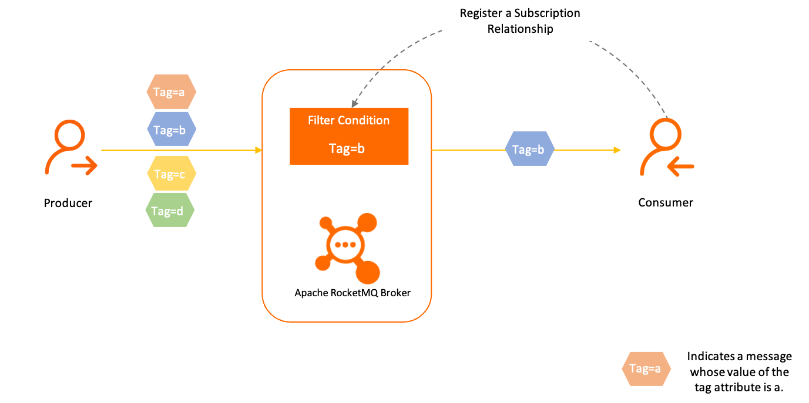

## RocketMq初印象

- Java 实现，方便修改和定制

- 当前版本为5.1.0
  - 移除了producerGroup。本意是为了能够找到事务消息状态确认和回滚对应的处理方法。但是在实际的生产中，很少存在同一个topic对应不同的处理方式（该场景一般会使用不同的topic）。所以5.0版本以上做了匿名处理，不再需要进行配置
  
- 支持事务消息、定时消息、延时消息、顺序消息

- 支持消息过滤，通过Tag进行配置，在RocketMq服务端进行过滤，而非在消费者侧进行过滤

  > 还支持SQL过滤，通过生产者设置Property，消费者订阅时制定Filter规则进行过滤

  

- 下表显示了RocketMQ、ActiveMQ和Kafka之间的比较 

## RocketMQ vs. ActiveMQ vs. Kafka

| Messaging Product|Client SDK| Protocol and Specification | Ordered Message  | Scheduled Message | Batched Message |BroadCast Message| Message Filter|Server Triggered Redelivery|Message Storage|Message Retroactive|Message Priority|High Availability and Failover|Message Track|Configuration|Management and Operation Tools|
| -------|--------|--------|-----|-----|-----|-----|-----|-----|-----|-----|-----|-----|-----|-----|-----|
| ActiveMQ|Java, .NET, C++ etc. |Push model, support OpenWire, STOMP, AMQP, MQTT, JMS|Exclusive Consumer or Exclusive Queues can ensure ordering|Supported|Not Supported|Supported|Supported|Not Supported|Supports very fast persistence using JDBC along with a high performance journal，such as levelDB, kahaDB|Supported|Supported|Supported, depending on storage,if using levelDB it requires a ZooKeeper server|Not Supported|The default configuration is low level, user need to optimize the configuration parameters|Supported|
| Kafka      | Java, Scala etc.|Pull model, support TCP|Ensure ordering of messages within a partition|Not Supported|Supported, with async producer|Not Supported|Supported, you can use Kafka Streams to filter messages|Not Supported|High performance file storage|Supported offset indicate|Not Supported|Supported, requires a ZooKeeper server|Not Supported|Kafka uses key-value pairs format for configuration. These values can be supplied either from a file or programmatically.|Supported, use terminal command to expose core metrics|
| RocketMQ      |Java, C++, Go |Pull model, support TCP, JMS, OpenMessaging|Ensure strict ordering of messages,and can scale out gracefully|Supported|Supported, with sync mode to avoid message loss|Supported|Supported, property filter expressions based on SQL92|Supported|High performance and low latency file storage|Supported timestamp and offset two indicates|Not Supported|Supported, Master-Slave model, without another kit|Supported|Work out of box,user only need to pay attention to a few configurations|Supported, rich web and terminal command to expose core metrics|