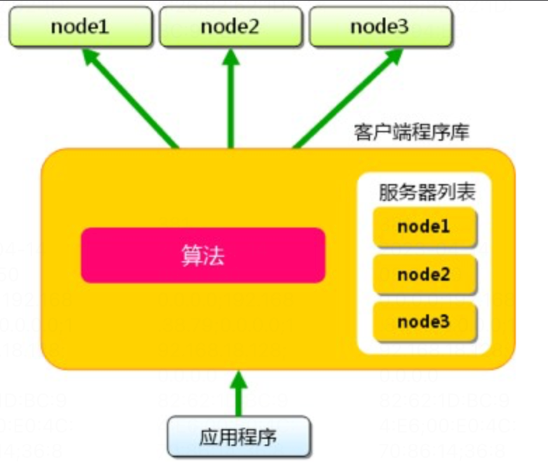
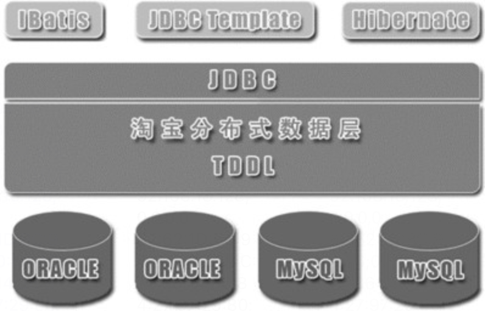
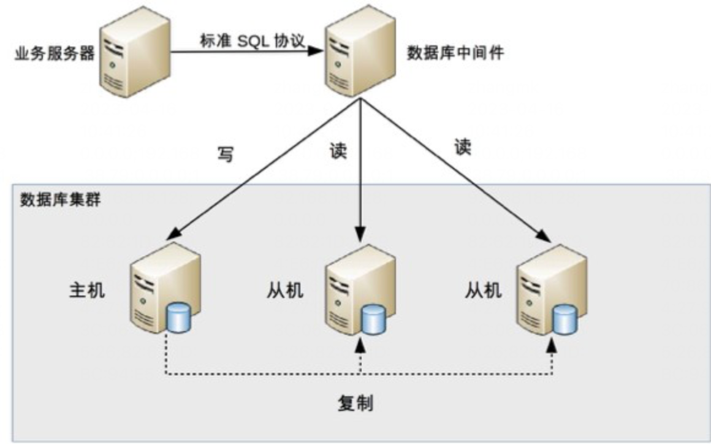

## 01 架构是什么

需要关注几个概念

- *系统-子系统*：“系统泛指由一群有**关联**的个体组成，根据某种**规则**运作，**能完成个别元件不能单独完成的工作的群体**（提供新的能力）。它的意思是“总体”“整体”或“联盟”

- *模块和组件*：“从逻辑的角度来拆分系统后，得到的单元就是“模块”；从物理的角度来拆分系统后，得到的单元就是“组件”。**划分模块的主要目的是职责分离；划分组件的主要目的是单元复用**。”

  > “组件”的英文 component 也可翻译成中文的“零件”一词，“零件”更容易理解一些，“零件”是一个物理的概念，并且具备“独立且可替换”的特点。”

- *框架和架构*：

  **架构：“软件架构指软件系统的顶层结构”**

  - “软件框架（Software framework）通常指的是为了实现某个业界标准或完成特定基本任务的软件**组件规范**，也指为了实现某个软件组件规范时，**提供规范所要求之基础功能的软件产品**”

    > 1. “框架是组件规范：例如，MVC 就是一种最常见的开发规范，类似的还有 MVP、MVVM、J2EE 等框架。”
    >
    > 2. “框架提供基础功能的产品：例如，Spring MVC 是 MVC 的开发框架，除了满足 MVC 的规范，Spring 提供了很多基础功能来帮助我们实现功能，包括注解（@Controller 等）、Spring Security、Spring JPA 等很多基础功能”

  - “软件架构指软件系统的**“基础结构”**，创造这些基础结构的准则，以及对这些结构的描述。”

  - “框架关注的是“规范”，架构关注的是“结构” ，框架的英文是 Framework，架构的英文是 Architecture”

  - 但是很多时候会模棱两可，因为“基础结构”这个概念并没有明确说是从什么角度来分解的。采用不同的角度或者维度，可以将系统划分为不同的结构” - 业务、技术角度等等

    > <u>*TODO：学习了解 “ IBM 的 RUP 将软件架构视图分为著名的 4+1 视图的原因。”*</u>

## 02 软件架构的历史背景

机器语言 -> 汇编语言 -> 高级语言 -> 结构化程序设计（第一次软件危机） -> 面向对象（第二次软件危机）

> 第二次软件危机的根本原因还是在于软件生产力远远跟不上硬件和业务的发展。第一次软件危机的根源在于软件的“逻辑”变得非常复杂，而第二次软件危机主要体现在软件的“扩展”变得非常复杂。

## 03 架构设计的目的

***“为了解决软件系统复杂度带来的问题 。”***

*”软件开发最本质的挑战有两个：复杂和变更，而软件的价值是保证业务的响应力，而与之相对的开发资源的有限，而各种的软件开发方法论，也都是在研究有限的资源下，如何应对着两个挑战，寻找平衡点，实现业务目标，因为是在寻找平衡点，就说明是有取舍的，所以就没有所谓的银弹的存在“*

*”架构师的作用在于各种场景中做出合适的取舍，而不是像普通程序员那样陷入Paxos还是Raft好的争论中。PowerShell之父Jerrery Snover有一句话叫，To ship is to choose，讲的就是取舍的问题“*

## 04-07 复杂度来源

#### 高性能

技术的发展会带来性能的提升，但并不一定带来负责度的提升，只有那些并不是用来取代旧技术，而是开辟了一个全新领域的技术，才会给软件系统带来复杂度。

软件系统中高性能带来的复杂度主要体现在两方面：

- 一方面是**单台计算机内部**为了高性能带来的复杂度
- 另一方面是**多台计算机集群**为了高性能带来的复杂度 

##### 单机复杂度

“计算机内部复杂度最关键的地方就是操作系统。计算机性能的发展本质上是由硬件发展驱动的，尤其是 CPU 的性能发展”。

进程 -> 线程 -> 多核：“有了多线程后，操作系统调度的最小单位就变成了线程，而进程变成了操作系统分配资源的最小单位。”

> “这些技术并不是最新的就是最好的，也不是非此即彼的选择，在做架构设计的时候，需要花费很大的精力来结合业务进行分析、判断、选择、组合”
>
> 如：Nginx 可以用多进程也可以用多线程，JBoss 采用的是多线程；Redis 采用的是单进程，Memcache 采用的是多线程，这些系统都实现了高性能，但内部实现差异却很大
>

##### 集群复杂度

> *随着业务的发展，单机的性能是很难支撑复杂业务的，必须采用机器集群的方式来达到高性能*

- **任务分配**（不断加机器)

  - 每台机器都可以处理完整的业务任务，不同的任务分配到不同的机器上执行

  - 复杂度提升的点

    - 需要增加一个任务分配器（硬件网络设备：F5、交换机；软件网络设备：LVS；负载均衡软件：Nginx，HAProxy；某种分配算法：memcache）

      > 实际上“任务”涵盖的范围很广，可以指完整的业务处理，也可以单指某个具体的任务 。例如，“存储”“运算”“缓存”等都可以作为一项任务，因此存储系统、运算系统、缓存系统都可以按照任务分配的方式来搭建架构。此外，“任务分配器”也并不一定只能是物理上存在的机器或者一个独立运行的程序，也可以是嵌入在其他程序中的算法，例如 Memcache 的集群架构。（分配算法嵌套在客户端程序中）
      >
      > 
      >
      > 
      >
      > 
      >
      > 
      >
      > <u>*TODO：学习了解 Memcache 架构*</u>

      

    - 任务分配器和业务服务器之间的连接管理

    - 任务的分配算法（轮询、权重、负载等等）

    - 任务分配器的扩容（任务分配器也需要分配；*一对多关系变为多对多关系*；机器数量增加导致故障处理时会更复杂）

- **任务分解**
  - 业务越来越复杂，单台机器处理的性能会越来越低
  - 本质上就是微服务，根据业务进行服务拆分
    - 简单的系统更加容易做的高性能
    - 可以针对单个任务进行扩展

#### 高可用

> *系统**无中断地执行其功能**的能力，代表系统的可用性程度，是进行系统设计时的准则之一。*
>
> *系统的高可用方案五花八门，但万变不离其宗，**本质上都是通过 “冗余” 来实现高可用***
>
> ------
>
> ***高性能增加机器目的在于“扩展”处理性能；***
>
> ***高可用增加机器目的在于“冗余”处理单元***

##### 计算高可用

- 无论在哪台机器上进行计算，同样的算法和输入数据，产出的结果都是一样的

- 分配器和高性能类似，常见的双机算法有**主备、主主**，主备方案又可以细分为冷备、温备、热备（区别在于是否可以随时提供服务）

  > ZooKeeper 采用的就是 1 主多备，而 Memcached 采用的就是全主 0 备
  >

##### 存储高可用

> 1. *存储与计算相比，有一个本质上的区别：将数据从一台机器搬到到另一台机器，需要经过线路进行传输*
>
> 2. 除了物理上的传输速度限制，传输线路本身也存在可用性问题，传输线路可能中断、可能拥塞、可能异常（错包、丢包），并且传输线路的故障时间一般都特别长，短的十几分钟，长的几个小时都是可能的

- 存储高可用的难点不在于如何备份数据，而**在于如何减少或者规避数据不一致对业务造成的影响**。

##### 状态决策

> 通过冗余来实现的高可用系统，状态决策本质上就不可能做到完全正确

| 决策方式 | 方式                                                         | 难点或者缺陷                                                 |
| -------- | ------------------------------------------------------------ | ------------------------------------------------------------ |
| 独裁式   | 独立的决策主体，所有冗余的个体都上报状态信息给决策者         | 决策者本身故障时，无法做出正确的决策                         |
| 协商式   | 两个独立的个体通过交流信息，然后根据规则进行决策，最常用的协商式决策就是主备决策 | 如果两者的信息交换出现问题（比如主备连接中断）时如何处理     |
| 民主式   | 多个独立的个体通过投票的方式来进行状态决策（ZooKeeper的leader选举，选举算法Paxos） *TODO ZK Paxos选举算法* | 算法复杂 可能会脑裂 - 为了解决脑裂问题，民主式决策的系统一般都采用“投票节点数必须超过系统总节点数一半”规则来处理 |

#### 可扩展

##### 基本条件

1. 正确预测变化

   > 复杂度来源：*不能每个设计点都考虑可扩展性。不能完全不考虑可扩展性。所有的预测都存在出错的可能性*

2. 完美封装变化

   1. 将“变化”封装在一个“变化层”，将不变的部分封装在一个独立的“稳定层（向上或者向下的抽象接口层：可接收不同格式的输入或者可对接不同类型的存储）
   2. 提炼出一个“抽象层”和一个“实现层“（设计模式、规则引擎）

   > 抽象层是稳定的，实现层可以根据具体业务需要定制开发，当加入新的功能时，只需要增加新的实现，无须修改抽象层
   >
   > 1是从上到下，或者从下到上
   >
   > 2是从内到位的组合

##### 常用手段

在实际软件系统架构设计中，常通过以下技术手段实现良好的可扩展性:

（1）使用分布式服务(框架)构建可复用的业务平台。

（2）使用分布式消息队列降低业务模块间的耦合性。

#### 低成本、安全、规模

- **低成本**：给架构设计带来的主要复杂度体现在，往往只有“创新”才能达到低成本目标。引入和创造新技术都有成本

- **安全**：从技术的角度来讲，安全可以分为两类：一类是功能上的安全（防小偷），一类是架构上的安全（防强盗）

  > 互联网系统的架构安全目前并没有太好的设计手段来实现，更多地是依靠运营商或者云服务商强大的带宽和流量清洗的能力，较少自己来设计和实现。
  >

- **规模**：“规模带来复杂度的主要原因就是“量变引起质变”

  > Google File System 是大数据文件存储的技术理论
  >
  > Google Bigtable 是列式数据存储的技术理论
  >
  > Google MapReduce 是大数据运算的技术理论，这三篇技术论文各自开创了一个新的技术领域

## 08-09 架构设计原则&案例

*成为架构师是每个程序员的梦想，但并不意味着把编程做好就能够自然而然地成为一个架构师*

*优秀程序员和架构师之间还有一个明显的鸿沟需要跨越，这个鸿沟就是**“不确定性”***

#### 合适原则

***合适优于业界领先***

没有了大公司的平台、资源、积累，只是生搬硬套大公司的做法，失败的概率非常高

#### 简单原则

***简单优于复杂***

“复杂”在制造领域代表先进，在建筑领域代表领先，但在软件领域，却恰恰相反，代表的是“问题”

- 结构复杂：组件数量多，关系复杂，易出故障，定位问题困难
- 逻辑复杂：算法复杂。zookeeper采用zab协议实现选举，系统实现复杂；etcd采用raft算法，相比之前更容易理解和实现

UNIX 编程艺术总结的 KISS（Keep It Simple, Stupid!）原则一样适应于架构设计。

#### 演化原则

***演化优于一步到位***

避免过度设计、一步到位的想法

## 10-13 架构设计流程

### 识别复杂度

> - 构建复杂度的来源清单——高性能、可用性、扩展性、安全、低成本、规模等。
>
> - 结合需求、技术、团队、资源等对上述复杂度逐一分析是否需要？是否关键？
>
>   - “高性能”主要从软件系统未来的TPS、响应时间、服务器资源利用率等客观指标，也可以从用户的主观感受方面去考虑。
>
>   - “可用性”主要从服务不中断等质量属性，符合行业政策、国家法规等方面去考虑。
>
>   - “扩展性”则主要从功能需求的未来变更幅度等方面去考虑。
>
> - 按照上述的分析结论，得到复杂度按照优先级的排序清单，越是排在前面的复杂度，就越关键，就越优先解决
>
> ***需要特别注意的是：随着所处的业务阶段不同、外部的技术条件和环境的不同，得到的复杂度问题的优先级排序就会有所不同。一切皆变化***

将主要的复杂度问题列出来，然后根据业务、技术、团队等综合情况进行排序，优先解决当前面临的最主要的复杂度问题

对于架构师来说

- 关注的不是一天的数据，而是 1 秒的数据，即 TPS 和 QPS

- 常见系统的性能量级需要烂熟于心，例如nginx负载均衡性能是3万左右，mc的读取性能5万左右，kafka号称百万级，zookeeper写入读取2万以上，http请求访问大概在2万左右

### 备选方案

> 在《技术的本质》一书中，对技术的组合有清晰的阐述：
>
>
> 新技术都是在现有技术的基础上发展起来的，现有技术又来源于先前的技术。将技术进行功能性分组，可以大大简化设计过程，这是技术“模块化”的首要原因。技术的“组合”和“递归”特征，将彻底改变我们对技术本质的认识。
>

#### 如何设计最终设计方案

多个解决方案的情况下，**常见的错误**

1. “设计最优秀的方案”：需要根据架构设计原则中“合适原则”和“简单原则“的要求，挑选合适自己业务、团队、技术能力的方案才是好方案
2. ”只做一个方案“：避免考虑片面；避免架构师经验知识技能的局限性；单一方案设计会出现过度辩护的情况“
   1. 备选方案的数量以 3 ~ 5 个为最佳
   2. 备选方案直接差异要比较明显（架构上的差异，而非细节上的差异）
   3. 不要只局限于自己已经熟悉的技术
3. 备选方案过于详细：正确的做法是备选阶段关注的是技术选型，而不是技术细节，技术选型的差异要比较明显。

> *TODO：ZooKeeper 和 Keepalived 两种不同的技术来实现主备，差异就很大*

### 评估和选择备选方案

- 最简派：选择一个看起来最简单的方案
- 最牛派：倾向于挑选技术上看起来最牛的方案
- 最熟派：挑选自己最熟悉的方案
- 领导派：找领导拍板
- **建议：360°环评。**
  - **列出我们需要关注的质量属性点，然后分别从这些质量属性的维度去评估每个方案，再综合挑选适合当时情况的最优方案 。**
  - 常见的方案质量属性点有：性能、可用性、硬件成本、项目投入、复杂度、安全性、可扩展性等
  - 按优先级选择，即架构师综合当前的业务发展情况、团队人员规模和技能、业务发展预测等因素，将质量属性按照优先级排序，首先挑选满足第一优先级的，如果方案都满足，那就再看第二优先级……以此类推。那会不会出现两个或者多个方案，每个质量属性的优缺点都一样的情况呢？理论上是可能的，但实际上是不可能的。前面我提到，在做备选方案设计时，不同的备选方案之间的差异要比较明显，差异明显的备选方案不可能所有的优缺点都是一样的。

### 详细方案设计

#### 异常情况

- 在详细设计阶段发现备选方案不可行，一般情况下主要的原因是备选方案设计时遗漏了某个关键技术点或者关键的质量属性

- 如何避免
  - 架构师不但要进行备选方案设计和选型，还需要对备选方案的关键细节有较深入的理解。不能道听途说 XXX 很牛，所以选择它，更不能成为把“细节我们不讨论”这句话挂在嘴边的PPT架构师
  - 通过分步骤、分阶段、分系统等方式，尽量降低方案复杂度，可以减少风险
  - 如果方案本身就很复杂，那就采取**设计团队**的方式来进行设计，博采众长，汇集大家的智慧和经验，防止只有 1~2 个架构师可能出现的思维盲点或者经验盲区

## 14-21 高性能架构模式

### 数据库集群

#### 读写分离

> **读写分离分散了数据库读写操作的压力，但没有分散存储压力，当数据量达到千万甚至上亿条的时候，单台数据库服务器的存储能力会成为系统的瓶颈**
>
> - 数据量太大，读写的性能会下降，即使有索引，索引也会变得很大，性能同样会下降
>
> - 数据文件会变得很大，数据库备份和恢复需要耗费很长时间
>
> - 数据文件越大，极端情况下丢失数据的风险越高

**基本原理**：将数据库读写操作分散到不同的节点上

**基本实现**：一主一从或多从；主机读写从机只读；主机同步数据到从；读写请求分别发往不同机器（主从不同于主备，”备机“一般是指备份，不提供服务）

**复杂度关键点**：

- 主从复制延迟

  - 写操作后的读操作指定发给数据库主服务器（业务侵入性较大）
  - 读从机失败后再读一次主机（二次读取；对底层数据库API封装改造；如果有大量二次读取，对主机压力偏大）
  - 关键业务读写操作全部指向主机，非关键业务采用读写分离

- 分配机制

  - **程序代码封装**：在代码中抽象一个数据访问层（所以有的文章也称这种方式为“中间层封装”），实现读写操作分离和数据库服务器连接的管理

    > *TODO：TDDL “Taobao Distributed Data Layer”*
    >
    > 基本原理：它是一个通用数据访问层，所有功能封装在 jar 包中提供给业务代码调用。其基本原理是一个基于集中式配置的 jdbc datasource 实现，具有主备、读写分离、动态数据库配置等功能
    >
    > 基本架构：
    >
    > 

    - 实现简单，可深度定制
    - 无法通用，各语言需自行实现
    - 主从切换时，可能需要修改很多机器配置并重启

  - **中间件封装**：独立一套系统出来，实现读写操作分离和数据库服务器连接的管理。中间件对业务服务器提供 SQL 兼容的协议，业务服务器无须自己进行读写分离。对于业务服务器来说，访问中间件和访问数据库没有区别，事实上在业务服务器看来，中间件就是一个数据库服务器

    > *TODO：MySQL Proxy；MySQL Router；[Atlas](https://github.com/Qihoo360/Atlas/wiki/Atlas%E7%9A%84%E6%9E%B6%E6%9E%84)*

    - 基本架构

      

    - 特点：

      - 能够支持多种编程语言，因为数据库中间件对业务服务器提供的是标准 SQL 接口。
      - 数据库中间件要支持完整的 SQL 语法和数据库服务器的协议（例如，MySQL 客户端和服务器的连接协议），实现比较复杂，细节特别多，很容易出现 bug，需要较长的时间才能稳定。
      - 数据库中间件自己不执行真正的读写操作，但所有的数据库操作请求都要经过中间件，中间件的性能要求也很高。
      - 数据库主从切换对业务服务器无感知，数据库中间件可以探测数据库服务器的主从状态

#### 分库分表

##### 业务分库

**定义**：按照业务模块将数据分散到不同的数据库服务器

> *一般来说，单台数据库服务器能够支撑 10 万用户量量级的业务*

**缺点**：

- 无法使用SQL的Join
- 事务需要使用分布式事务
- 成本问题（数据库服务器增加，主备都要翻倍）

##### 分表

- 垂直分表：扩展表或者业务拆分，通过ID关联。**引入的复杂性主要体现在表操作的数量要增加**
- 水平分表：按行拆分，一个大表变为多个小表
  - 行数并没有明确的规定，要看表的访问性能。但是表的数量级达到千万时就要警觉了。
  - 复杂性
    - 路由：判断数据属于切分后的哪个子表（范围路由；Hash路由；配置路由）
    - Join：需要在业务代码或者数据库中间件中进行多次 join 查询，然后将结果合并
    - count：count()相加；新增记录数表
    - orderBy：由业务代码或者数据库中间件分别查询每个子表中的数据，然后汇总进行排序

------

### NoSQL-Not Only SQL

> *NoSQL 方案带来的优势，本质上是牺牲 ACID 中的某个或者某几个特性*

#### 关系型数据库缺点

- 存储的是行记录，无法存储数据结构
- schema扩展不方便
- 大数据场景下I/O较高
- 全文搜索较弱

#### K-V存储

- Redis是典型代表
- Redis 的缺点主要体现在并不支持完整的 ACID 事务，Redis 虽然提供事务功能，但 Redis 的事务和关系数据库的事务不可同日而语，Redis 的事务只能保证隔离性和一致性（I 和 C），无法保证原子性和持久性（A 和 D）。

#### 文档数据库

- No schema
- 目前绝大部分文档数据库存储的数据格式是 JSON（或者 BSON），因为 JSON 数据是自描述的，无须在使用前定义字段，读取一个 JSON 中不存在的字段也不会导致 SQL 那样的语法错误
- 不支持事务
- **无法实现join操作**

#### 列式数据库

> ***一般将列式存储应用在离线的大数据分析和统计场景中，因为这种场景主要是针对部分列单列进行操作，且数据写入后就无须再更新删除。***

- 业务同时读取多个列时效率高，因为这些列都是按行存储在一起的，一次磁盘操作就能够把一行数据中的各个列都读取到内存中(节省IO)
- 列式存储还具备更高的存储压缩比，能够节省更多的存储空间。普通的行式数据库一般压缩率在 3:1 到 5:1 左右，而列式数据库的压缩率一般在 8:1 到 30:1 左右，因为单个列的数据相似度相比行来说更高，能够达到更高的压缩率。
- 因为列式存储将不同列存储在磁盘上不连续的空间，导致**更新多个列时磁盘是随机写操作**；而行式存储时同一行多个列都存储在连续的空间，一次磁盘写操作就可以完成

#### 全文搜索引擎

**基本原理**：全文搜索引擎的技术原理被称为“倒排索引”（Inverted index），也常被称为反向索引、置入档案或反向档案，是一种索引方法，其基本原理是建立单词到文档的索引。

> 全文搜索引擎能够基于 JSON 文档建立全文索引，然后快速进行全文搜索。以 Elasticsearch 为例，其索引基本原理如下
>
> Elastcisearch 是分布式的文档存储方式。它能存储和检索复杂的数据结构——序列化成为 JSON 文档——以实时的方式。
>
>
> 在 Elasticsearch 中，每个字段的所有数据都是默认被索引的。即每个字段都有为了快速检索设置的专用倒排索引。而且，不像其他多数的数据库，它能在相同的查询中使用所有倒排索引，并以惊人的速度返回结果。
>

------

### 缓存架构

*需要经过复杂运算后得出的数据，存储系统无能为力*

*读多写少的数据，存储系统有心无力*

#### 缓存穿透

缓存没有发挥作用，业务系统虽然去缓存查询数据，但缓存中没有数据，业务系统需要再次去存储系统查询数据

- 数据不存在（不存在返回空）
- 生成缓存需要较长时间或者资源（比较冷的数据不好禁止，做好监控吧，没有太好办法）

#### 缓存雪崩

当缓存失效（过期）后引起系统性能急剧下降

- 更新锁机制（分布式锁）
- 后台更新机制（定时更新；除了定时更新，还要去读取，避免缓存被清理后访问不到。或者业务服务去通知更新）

#### 缓存热点

缓存热点的解决方案就是复制多份缓存副本，将请求分散到多个缓存服务器上，减轻缓存热点导致的单台缓存服务器压力

------

### 单服务器高性能

#### PPC和TPC

> 单服务器高性能的关键之一就是服务器采取的并发模型。如何管理连接、如何处理请求
>
> **PPC和TPC适用于常量连接的场景，无法支撑高并发场景**
>
> 三高系统，比如秒杀、即时通信，不能使用。
>
> 三低系统，比如ToB系统，运营类、管理类系统，一般可以使用
>
> 高吞吐系统，如果是内存计算为主的，一般可以使用，如果是网络IO为主的，一般不能使用
>

- PPC 是 Process Per Connection 的缩写，其含义是指每次有新的连接就新建一个进程去专门处理这个连接的请求（fork, prefork）

  > prefork 的实现关键就是多个子进程都 accept 同一个 socket，当有新的连接进入时，操作系统保证只有一个进程能最后 accept 成功。但这里也存在一个小小的问题：“惊群”现象，就是指虽然只有一个子进程能 accept 成功，但所有阻塞在 accept 上的子进程都会被唤醒，这样就导致了不必要的进程调度和上下文切换了。幸运的是，操作系统可以解决这个问题，例如 Linux 2.6 版本后内核已经解决了 accept 惊群问题。
  >

- TPC 是 Thread Per Connection 的缩写，其含义是指每次有新的连接就新建一个线程去专门处理这个连接的请求

#### Reactor和Proactor

**Reactor**

- 选择进程还是线程，更多地是和编程语言及平台相关。例如，Java 语言一般使用线程（例如，Netty），C 语言使用进程和线程都可以。例如，Nginx 使用进程，Memcache 使用线程

- 单 Reactor 单进程的方案在实践中应用场景不多，只适用于业务处理非常快速的场景，目前比较著名的开源软件中使用单 Reactor 单进程的是 Redis。

- 目前著名的开源系统 Nginx 采用的是多 Reactor 多进程，采用多 Reactor 多线程的实现有 Memcache 和 Netty

  > “Nginx 采用的是多 Reactor 多进程的模式，但方案与标准的多 Reactor 多进程有差异。具体差异表现为主进程中仅仅创建了监听端口，并没有创建 mainReactor 来“accept”连接，而是由子进程的 Reactor 来“accept”连接，通过锁来控制一次只有一个子进程进行“accept”，子进程“accept”新连接后就放到自己的 Reactor 进行处理，不会再分配给其他子进程”
  >

**Proactor**

如果把 I/O 操作改为异步就能够进一步提升性能，这就是异步网络模型 Proactor

Reactor可以理解为“来了事件我通知你，你来处理”，而 Proactor 可以理解为“来了事件我来处理，处理完了我通知你”。

> 目前 Windows 下通过 IOCP 实现了真正的异步 I/O，而在 Linux 系统下的 AIO 并不完善，因此在 Linux 下实现高并发网络编程时都是以 Reactor 模式为主。所以即使 Boost.Asio 号称实现了 Proactor 模型，其实它在 Windows 下采用 IOCP，而在 Linux 下是用 Reactor 模式（采用 epoll）模拟出来的异步模型。
>

### 复杂均衡

> *负载均衡不只是为了计算单元的负载达到均衡状态*

- 类型

  - DNS负载均衡、硬件负载均衡、软件负载均衡

  - 软件负载均衡：常见的有 Nginx 和 LVS，其中 Nginx 是软件的 7 层负载均衡，LVS 是 Linux 内核的 4 层负载均衡。4 层和 7 层的区别就在于协议和灵活性 ，Nginx 支持 HTTP、E-mail 协议；而 LVS 是 4 层负载均衡，和协议无关，几乎所有应用都可以做，例如，聊天、数据库等。

  - DNS负载均衡用于实现地理级别的负载均衡；硬件负载均衡用于实现集群级别的负载均衡；软件负载均衡用于实现机器级别的负载均衡。

- 算法
  - 任务平分类 - 轮询、加权轮询
  - 负载均衡类（系统压力：CPU负载、连接数、I/O使用率、网卡吞吐量等等）
  - 性能最优类（响应最快）
  - Hash

------

## 22-31高可用架构模式

## 32-39 可扩展架构

## 40-44 架构模板

## 其他

### 架构师对技术细节的考虑程度

1. 搭建一个单机伪集群，搭建完成后看看安装路径下的文件和目录，看看配置文件有哪些配置项，不同的配置项会有什么样的影响
2. 执行常用的操作，例如创建索引，插入、删除、查询文档，查看一下各种输出。
3. 研究其**基本原理**，例如索引、分片、副本等，研究的时候要多思考，例如索引应该如何建，分片数量和副本数量对系统有什么影响等。
4. 和其他类似系统对比，例如 Solr、Sphinx，研究其**优点、缺点、适用场景**。
5. 模拟一个案例看看怎么应用。例如，假设我用 Elasticsearch 来存储淘宝的商品信息，我应该如何设计索引和分片。
6. 查看业界使用的案例，思考一下别人为何这么用；看看别人测试的结果，大概了解性能范围。
7. 如果某部分特别有兴趣或者很关键，可能去看源码，例如 Elasticsearch 的选举算法。
8. 如果确定要引入，会进行性能和可用性测试。